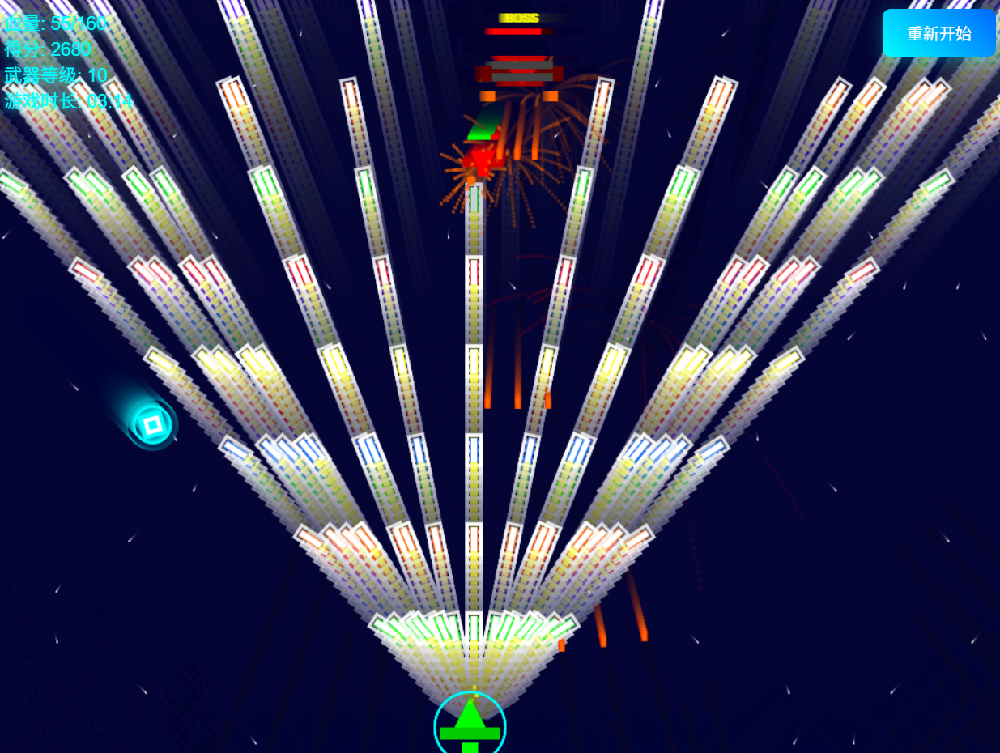

# 飞机大战 - Aircraft Battle

一个基于HTML5 Canvas和JavaScript开发的炫酷飞机大战游戏，具有丰富的武器系统、Boss战斗和粒子特效。

## 🎮 游戏玩法

### 基本操作
- **WASD键**：控制飞机移动
  - W：向上移动
  - S：向下移动
  - A：向左移动
  - D：向右移动
- **鼠标点击**：开始游戏
- **重新开始按钮**：随时重新开始游戏（位于右上角）

### 游戏目标
- 击毁敌机获得分数
- 收集能量豆升级武器和回复血量
- 挑战越来越强的敌机和Boss
- 尽可能获得更高的分数

### 武器系统
游戏包含10个武器等级，每个等级都有独特的射击模式：

1. **1级**：单发子弹
2. **2级**：双发子弹
3. **3级**：三发子弹（中间为增强型）
4. **4级**：四发子弹（前排增强型）
5. **5级**：扇形扫射（5发扇形子弹）
6. **6级**：超级扫射（7发扇形+1发激光）
7. **7级**：激光炮模式（5发激光+3发增强）
8. **8级**：螺旋弹幕（8发螺旋子弹）
9. **9级**：全方位攻击（9发激光+6发螺旋）
10. **10级**：终极武器（11发终极子弹+12发环形弹幕）

### 子弹类型
- **普通子弹**：黄色基础子弹
- **增强子弹**：橙色加粗子弹，伤害更高
- **扫射子弹**：绿色扇形子弹
- **激光子弹**：粉色激光，带光晕效果
- **螺旋子弹**：紫色螺旋运动轨迹
- **终极子弹**：彩虹色变换，带白色光晕

## 🚀 游戏特点

### 敌机系统
- **普通敌机**：会主动向玩家靠拢，初始血量5点
- **Boss敌机**：更大更强，初始血量23点，会发射子弹攻击玩家
- **智能AI**：敌机会追踪玩家位置
- **血量显示**：敌机头顶显示血量条

### 动态难度
- **血量增长**：敌机血量每10秒增加初始血量的50%
- **挑战递增**：游戏时间越长，敌机越难击败
- **Boss强化**：Boss血量也会随时间增长
- **血量上限提升**：每击败一个Boss，玩家血量上限增加5点

### 能量豆系统
- **武器升级**：收集能量豆升级武器等级
- **血量回复**：每个能量豆回复10点血量
- **随机移动**：能量豆在屏幕中随机移动，不会直线下落
- **边界反弹**：碰到屏幕边缘会反弹

### 视觉特效
- **粒子系统**：爆炸、射击、升级、受伤等各种粒子特效
- **动态背景**：星空背景动画
- **光环效果**：玩家飞机护盾、能量豆光环
- **子弹尾迹**：高级子弹带有尾迹效果

### 音效系统
- **背景音乐**：支持背景音乐播放
- **音量控制**：自动调节音量避免过于吵闹

### 游戏界面
- **实时信息**：显示血量、得分、武器等级、游戏时长
- **开始界面**：点击开始游戏
- **结束界面**：显示最终得分
- **重新开始**：随时可以重新开始游戏

## 🛠️ 技术特点

- **纯前端**：基于HTML5 Canvas和原生JavaScript
- **面向对象**：使用ES6类语法，代码结构清晰
- **高性能**：60FPS流畅动画
- **响应式**：适配不同屏幕尺寸
- **模块化**：各个游戏元素独立封装

## 🚀 启动方式

### 方法一：本地HTTP服务器（推荐）
1. 确保已安装Python
2. 在项目目录下打开终端
3. 运行以下命令：
   ```bash
   python -m http.server 8000
   ```
4. 在浏览器中访问：`http://localhost:8000`

### 方法二：直接打开文件
1. 直接双击 `index.html` 文件
2. 在浏览器中打开

### 方法三：使用其他HTTP服务器
- **Node.js**: `npx http-server`
- **PHP**: `php -S localhost:8000`
- **Live Server**: 使用VS Code的Live Server插件

## 📁 项目结构

```
aircraft_battle/
├── bgm/                # 背景音乐文件夹
├── picture/            # 图片资源文件夹
├── index.html          # 游戏主页面
├── game.js            # 游戏逻辑代码
└── README.md          # 项目说明文档
```

## 📸 示例截图



## 🎯 游戏技巧

1. **合理移动**：利用WASD键灵活躲避敌机和子弹
2. **收集能量豆**：优先收集能量豆升级武器和回血
3. **保持距离**：与敌机保持安全距离，避免碰撞
4. **专注Boss**：Boss出现时优先击败，获得更多分数
5. **时间管理**：注意游戏时长，敌机会越来越强

## 🏆 评分系统

- **普通敌机**：击败获得10分
- **Boss敌机**：击败获得100分
- **生存时间**：游戏时长越长，挑战越大

## 🎵 音频支持

游戏支持背景音乐播放，需要浏览器支持音频播放。如果音频无法播放，不会影响游戏核心功能。

## 🌟 未来计划

- [ ] 添加更多敌机类型
- [ ] 实现成就系统
- [ ] 添加更多音效
- [ ] 增加子弹类型
- [ ] 增加更多操作方式
- [ ] 增加更多bgm及打击音效
- [ ] 记录以往对战结果